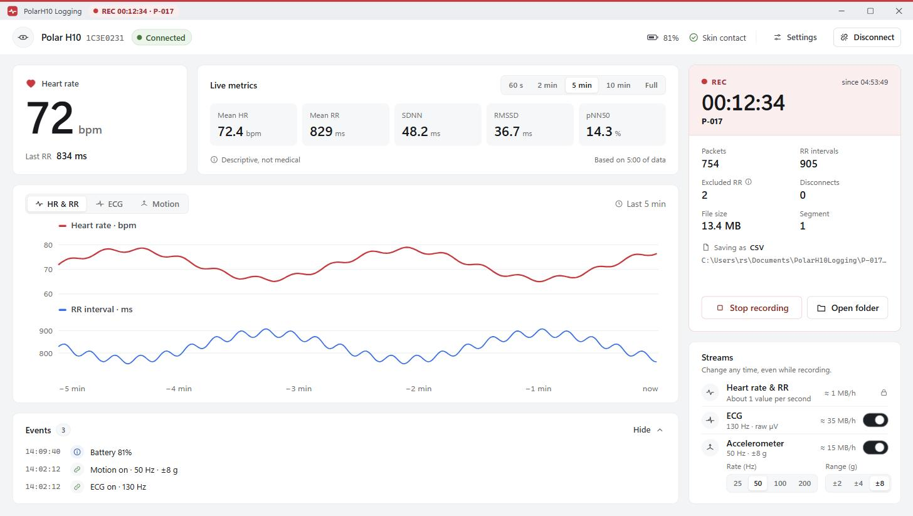
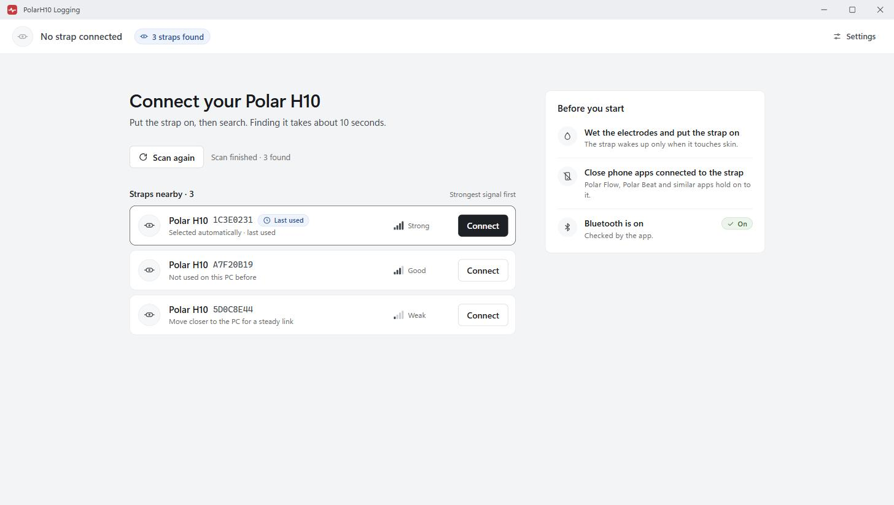
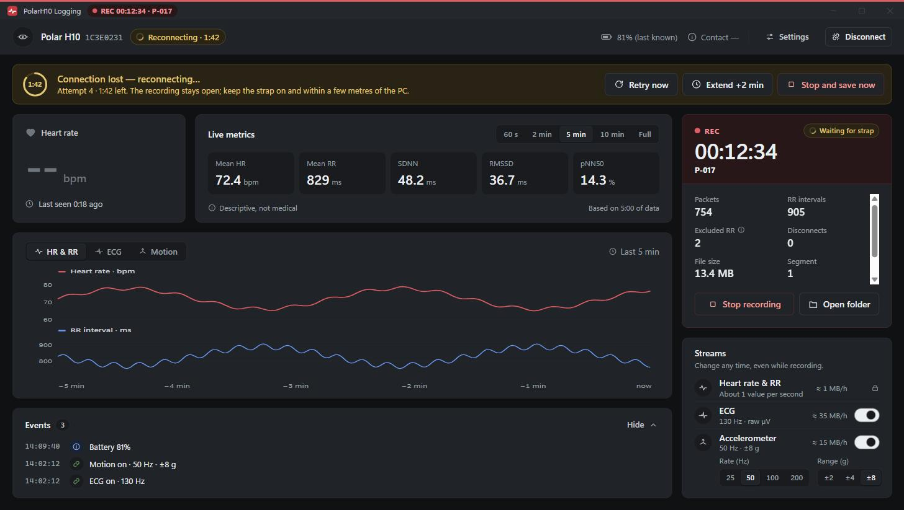

# PolarH10 Logging

A Windows app that records **Polar H10** chest-strap data for research: heart rate, every RR
interval and, when you want them, **raw ECG** (130 Hz) and the **accelerometer**
(25-200 Hz). Data is written to CSV as it arrives, with UTC timestamps.

Everything stays on the PC. The app makes no network connections, needs no account, and is
free and open source (MIT).



## Download

**[Download PolarH10Logging.exe](https://github.com/mishra-bytes/PolarH10Logging/releases/latest/download/PolarH10Logging.exe)**
(latest release, about 15 MB)

Copy it anywhere and double-click it. No install and no Python needed. The file is unsigned,
so Windows SmartScreen may warn on first run: **More info -> Run anyway**.

A console version for scripted recording,
[PolarH10Logging-cli.exe](https://github.com/mishra-bytes/PolarH10Logging/releases/latest/download/PolarH10Logging-cli.exe),
is in the same release. All releases: [Releases](https://github.com/mishra-bytes/PolarH10Logging/releases).

Requires Windows 10 or 11 with Bluetooth 4.0 or newer, and the Microsoft Edge WebView2
Runtime, which is already on Windows 11 and on most Windows 10 PCs.

## Recording a session



1. Wet the strap electrodes, put the strap on, and close any phone apps connected to it
   (Polar Flow and Polar Beat hold on to the strap).
2. Click **Find my Polar H10**, then **Connect** on your strap. The strap you used last is
   remembered and preselected, so the next session is one click.
3. Heart rate, RR intervals and the charts go live straight away. **Nothing is saved yet.**
   Turn on **ECG** and **Accelerometer** in the *Streams* card if you need them; the **ECG**
   and **Motion** chart tabs then show them live. These can be changed at any time, including
   mid-recording.
4. Enter a **Participant ID** (a research code, not a name), optionally a condition and
   notes, then click **Start recording**. Every packet is written to disk immediately.
5. **Stop recording** asks for confirmation, closes the files, writes the summary and shows
   the folder. The strap stays connected, so you can start the next recording right away.

### When the strap drops out



The recording stays open and the app keeps trying to reconnect for the **grace period**
(Settings, 2 minutes by default, up to 24 hours). A banner counts down and offers **Retry
now**, **Extend +2 min** and **Stop and save now**. When the strap comes back, the same
recording continues in a new segment. If the grace period runs out, the recording is
finalized cleanly and the banner tells you where it is.

If the PC shuts down mid-recording, the next start detects the interrupted session, rebuilds
its summary from the data on disk and says so. Nothing written before the interruption is
lost.

## What a session contains

Each recording gets its own folder, `<participant>_<YYYYMMDD>_<HHMMSS>`, under the output
folder (`Documents\PolarH10Logging` by default):

| File | Content |
|---|---|
| `HR_*.csv` | One row per RR interval, plus event rows. The primary file. |
| `ECG_*.csv` | Raw ECG in microvolts, one row per sample (only when ECG is on). |
| `ACC_*.csv` | Accelerometer in milli-g, one row per sample (only when it is on). |
| `summary.csv` | `metric,value` pairs for the whole recording. |
| `session.json` | Metadata: participant, device, status, counts, stream settings, events. |
| `raw.jsonl` | Every Bluetooth notification, lossless, for replay and debugging. |
| `app.log` | Application log for this recording. |

Column-by-column details, timing accuracy and the metric definitions are in
[docs/data-format.md](docs/data-format.md).

Size guide: heart rate and RR alone are about 1 MB per hour. ECG adds about 35 MB per hour,
the accelerometer about 15 MB per hour at 50 Hz and 60 MB per hour at 200 Hz.

Live metrics (mean HR, mean RR, SDNN, RMSSD, pNN50) are descriptive values over a window you
choose. They are **not a medical or diagnostic measurement**.

## Settings

- **Session folder** where recordings are written.
- **Reconnect grace period** and automatic rescanning.
- **Theme**: follow Windows, light, or dark.
- **Output formats**: CSV today; JSON Lines and Parquet are marked *coming next*.

## Command line

```text
PolarH10Logging-cli.exe --scan
PolarH10Logging-cli.exe --record --participant P07 [--device 1C3E0231] [--out DIR]
                        [--condition TEXT] [--notes TEXT] [--duration MIN] [--grace SEC]
                        [--ecg] [--acc] [--acc-rate 25|50|100|200] [--acc-range 2|4|8]
PolarH10Logging-cli.exe --fake --record --participant P07 [--replay raw.jsonl]
PolarH10Logging-cli.exe --recover SESSION_FOLDER
```

Exit codes: 0 ok, 2 Bluetooth unavailable, 3 no device or connect failed, 4 invalid input or
output folder, 5 storage failure, 6 recovery failure.

## Building from source

```powershell
py -3.12 -m venv .venv
.\.venv\Scripts\python -m pip install -e ".[dev]"
.\.venv\Scripts\python -m pytest
.\.venv\Scripts\python -m polarh10logging --fake   # app window with a simulated strap
.\build.ps1                                        # tests + dist\*.exe
```

The window is a WebView2 view (pywebview) over the Python session controller. The page in
`polarh10logging/web/` renders every screen and polls `Api.poll()` in `webui.py` a few times a
second; the Bluetooth, metrics and file code has no idea a browser is involved, which keeps it
testable on its own.

| Module | Responsibility |
|---|---|
| `transport.py` | Bluetooth: scanning, connecting, notifications (and a simulated strap). |
| `session.py` | Session state machine: connect, streams, reconnect grace, start/stop. |
| `storage.py` | Writes the CSV files, `session.json` and the summary, and fsyncs them. |
| `metrics.py` | Streaming HR/RR statistics for the live window and the summary. |
| `pmd.py` | Polar measurement protocol: ECG and accelerometer frames. |
| `recover.py` | Rebuilds the summary of an interrupted session. |
| `webui.py` + `web/` | The app window and everything in it. |
| `cli.py` | The console version. |

## Privacy

Heart-rate and ECG data can be personal health information. It never leaves the PC, but the
files are not encrypted: use coded participant IDs rather than names, and keep session folders
somewhere appropriate for your study's data policy.

## Licence

MIT, see [LICENSE](LICENSE). Third-party notices are in
[THIRD_PARTY_NOTICES.md](THIRD_PARTY_NOTICES.md).

Polar and H10 are trademarks of Polar Electro Oy. This project is independent and is not
affiliated with, endorsed by, or supported by Polar Electro.
